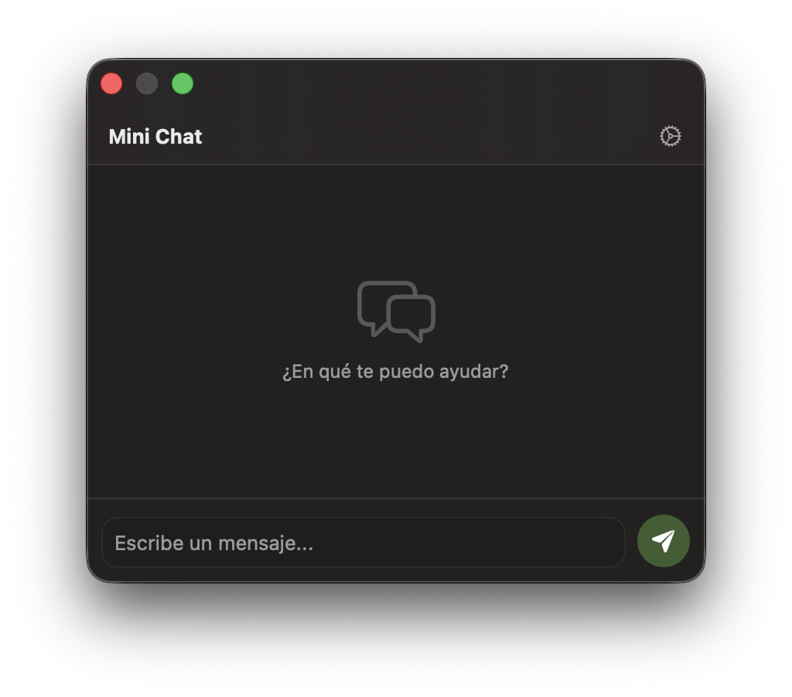
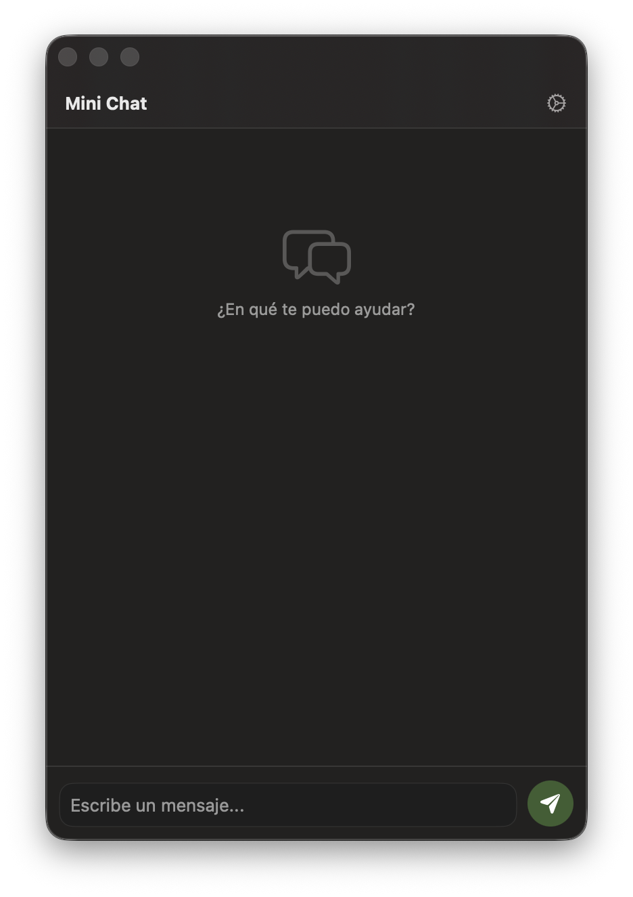

# FloatingChat

Aplicación de chat flotante para macOS, construida con SwiftUI y AppKit.

FloatingChat es una app pensada para hacer consultas pequeñas de forma rápida y concisa. Está optimizada para cuando necesitas resolver una pregunta corta o consultar un comando sin salir de tu flujo de trabajo.

## Qué hace

- Muestra un panel flotante siempre accesible.
- Se integra en la barra de menú de macOS.
- Permite mostrar u ocultar el panel con el atajo global Cmd + Shift + Space.
- Envía mensajes a OpenAI usando el endpoint de chat completions.
- Guarda la API key en Keychain y la configuración no sensible en UserDefaults.

## Capturas de pantalla

| Chat principal | Ajustes | Vista expandida |
|---|---|---|
|  |  |  |

## Requisitos

- macOS
- Xcode 15+
- Una API key de OpenAI

## Cómo ejecutar

1. Abre [FloatingChat.xcodeproj](FloatingChat.xcodeproj) en Xcode.
2. Selecciona el esquema FloatingChat.
3. Ejecuta con Product > Run.
4. Abre Ajustes (ícono de engrane) y agrega tu API key.

## Permisos de Accesibilidad

El atajo global **Cmd + Shift + Space** se registra mediante las APIs de **Carbon** (`RegisterEventHotKey`). En macOS moderno, esto requiere que la aplicación esté habilitada en **Seguridad y Privacidad > Accesibilidad** para poder interceptar eventos de teclado a nivel global.

### Cómo habilitar
1. Abrir **Preferencias del Sistema > Seguridad y Privacidad > Accesibilidad** (o **Privacidad y Seguridad > Accesibilidad** en macOS Ventura+).
2. Hacer clic en el candado y autenticarse para realizar cambios.
3. Arrastrar `FloatingChat.app` a la lista de apps permitidas (o usar el botón **+**).
4. Asegurarse de que la casilla junto a `FloatingChat` esté marcada.
5. Si la app ya estaba en la lista pero el atajo no responde, desmarcar y volver a marcar la casilla para forzar la re-autorización.

> Si el permiso no se otorga, el atajo global no funcionará; el panel solo se podrá mostrar/ocultar desde el ícono de la barra de menú.

## Uso rápido

- Escribe un mensaje y presiona Enter para enviar.
- Usa Shift + Enter para salto de línea.
- Usa el menú de la barra de menú para Mostrar / Ocultar y Salir.
- Botón de papelera para limpiar el historial local de la conversación.

## Estructura del proyecto

- [FloatingChat/](FloatingChat/): código fuente principal de la app.
- [FloatingChat/ContentView.swift](FloatingChat/ContentView.swift): interfaz de chat, burbujas, input y ajustes.
- [FloatingChat/OpenAIService.swift](FloatingChat/OpenAIService.swift): cliente HTTP para OpenAI y manejo de errores.
- [FloatingChat/FloatingChatApp.swift](FloatingChat/FloatingChatApp.swift): arranque de app, panel flotante, status bar y hotkey.
- [Package.swift](Package.swift): suite de pruebas rápida para la lógica principal con Swift Package Manager.
- [FloatingChat/Assets.xcassets/](FloatingChat/Assets.xcassets/): íconos y recursos visuales.
- [FloatingChat.xcodeproj/](FloatingChat.xcodeproj/): configuración del proyecto de Xcode.

## Notas

- La API key se guarda en el llavero del usuario actual.
- Si el panel no aparece, usa el ítem de la barra de menú para mostrarlo.
- El bundle compilado FloatingChat.app no debe versionarse en Git.

## Tests

Ejecuta `swift test` desde la raíz del proyecto para correr los tests del ViewModel y del cliente HTTP.

## Descarga

[Descargar última versión](https://github.com/jlpmedina/FloatingChat/releases/latest)

## Licencia

Pendiente de definir.
